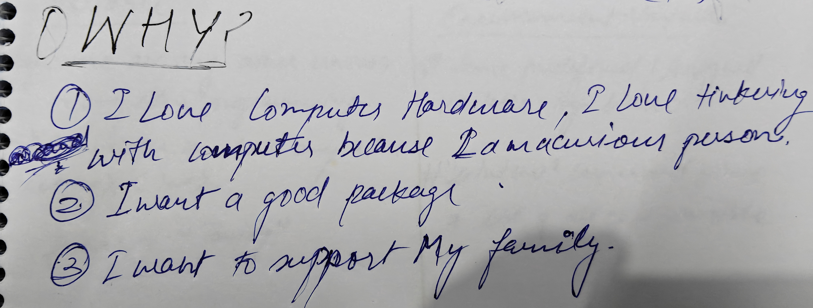

# My Understanding Of DevOps
___
- DevOps is mindset, proces, culture through which we can test, deploye and scale the application before it hits the market.
- DevOps bridges the gap between the development team(dev) and the IT/Operations team(Ops).

# Why I started learning DevOps?
___

- I also find DevOps quiet interesting.

## Current Level
- I am a B.tech, 4th year student from ECE branch.
- I do have an idea how things work in DevOps, and eager to learn more.
- I do have a little undertanding how linux works.

## Goals for the 90 days
- To learn how a DevOps engineer uses linux in their day to day life.
- To have good undertanding how kubernetes work and how to troubleshoot errors.
- To deploy and automate any applications with good reliability.

# 3 Core DevOps skill I want to build
___
- Kubernetes debugging.
- CI/CD pipelines.
- Automating entire workflow through AI agents.

